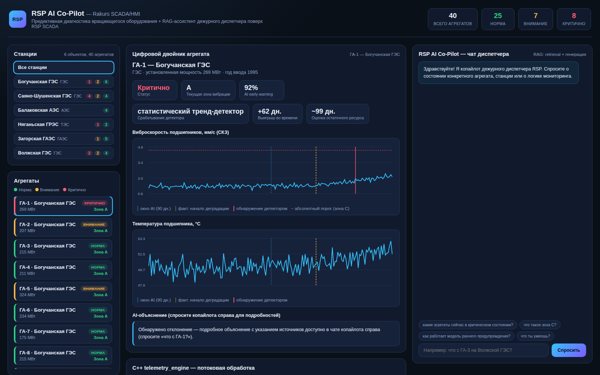

# RSP AI CO-PILOT

> **Статус: завершённый экспериментальный прототип, сохранённый для изучения.**
> Активное развитие этого репозитория прекращено. Это независимый демонстрационный
> проект; интеграция с продуктом RSP, участие его производителя и внедрение на
> энергообъектах не подтверждены. Основное портфолио: [GridGuard](https://github.com/Anton-Sergeev-EA/GridGuard),
> [ARGUS-NEURO](https://github.com/Anton-Sergeev-EA/ARGUS-NEURO) и
> [Cognivore](https://github.com/Anton-Sergeev-EA/Cognivore).

### Предиктивная диагностика оборудования и RAG-ассистент диспетчера (SCADA/HMI)

Технический прототип (PoC).
Показывает, как поверх флагманского продукта компании - SCADA/HMI-системы RSP - можно
надстроить слой ИИ: раннее предупреждение о деградации вращающегося оборудования
электростанций и чат-ассистента дежурного диспетчера, отвечающего на вопросы по
текущему состоянию парка агрегатов.

> **О проекте.** Технический прототип «RSP AI Co-Pilot»: объединяет предиктивную
> диагностику вращающегося оборудования электростанций (вибрация и температура
> подшипников) и RAG-ассистента дежурного диспетчера поверх SCADA/HMI. Модели обучены
> и работают по-настоящему; телеметрия синтетическая - доступа к реальным данным
> энергообъектов и к промышленной SCADA-системе заказчика не было.



---

## 1. Идея

Каждый агрегат (гидро-/турбогенератор) станции получает цифровой двойник: потоковый
C++ движок и нейросеть раннего предупреждения (LSTM) анализируют виброскорость и
температуру подшипников и формируют демонстрационные оценки риска. Преимущество
по времени предупреждения перед пороговым детектором не установлено. Поверх этого работает встроенный в
SCADA/HMI чат-CO-PILOT: диспетчер может спросить на естественном языке «что с ГА-3?»
или «какие агрегаты сейчас критичны?» и получить ответ, опирающийся на живые данные
конкретного агрегата и локальную базу эксплуатационных знаний (RAG).

## 2. Зачем это?

| Проблема сейчас | Что даёт RSP AI Co-Pilot | Эффект |
|---|---|---|
| Существующая SCADA-система отображает телеметрию и тревоги, но не объясняет их и не предсказывает развитие | Чат-копайлот на естественном языке объясняет статус агрегата и ссылается на базу эксплуатационных знаний | Меньше нагрузка на дефицитный инженерный персонал, быстрее адаптация новых дежурных |
| Аварийные протечки/деградации подшипников обнаруживаются, когда порог уже превышен | LSTM видит слабый тренд по первым 90 суткам эксплуатации — разница с порогом в демонстрации вычисляется относительно фиксированного дня 90; время первого срабатывания модели не измерено | Время на плановое, а не аварийное обслуживание — меньше внеплановых простоев генерирующего оборудования |
| RSP продаётся как система визуализации и сбора данных (лицензии/сервис) | Тот же поток телеметрии, который уже собирает RSP, превращается в основу для нового продукта — предиктивной аналитики и AI-ассистента | Новая продуктовая линейка поверх существующей установленной базы RSP, апселл действующим заказчикам |
| Дежурный персонал тратит время на поиск регламентов и интерпретацию тревог | RAG-слой генерирует объяснение на русском со ссылкой на локальную базу знаний и живые данные агрегата | Быстрее реакция, меньше зависимость от опыта конкретного дежурного |

## 3. Архитектура

```
                         СТАНЦИЯ (ГЭС / ТЭС / АЭС / ГАЭС)
                    вибрация подшипников + температура (SCADA-система)
                                      │
                                      ▼
                        ┌──────────────────────────┐
                        │  C++ telemetry_engine      │
                        │  потоковый детектор:        │
                        │  абсолютный порог + тренд   │
                        │  (фикс. базовая линия, EWMA, │
                        │   RUL)                       │
                        └─────────────┬────────────────┘
                                      │
                        ┌─────────────┴────────────────┐
                        │  LSTM early-warning            │
                        │  ml/predictive_model.py        │
                        │  (видит только первые 90 сут)  │
                        └─────────────┬────────────────┘
                                      ▼
        ┌──────────── ЦИФРОВОЙ ДВОЙНИК ПАРКА (backend/data/fleet/fleet.json) ────────────┐
        │                          FastAPI (backend/app.py)                                │
        └──────────────────────────────────┬──────────────────────────────────────────────┘
                                             │
                         RAG-копайлот (copilot.py + knowledge_base/kb.py):
                         извлечение сущностей из вопроса → retrieval → генерация
                                             │
                                             ▼
                          Веб-дашборд + чат (frontend/, HTML+CSS+JS,
                          встроен в стиле SCADA/HMI-панели диспетчера)
```

**Роль C++:** `telemetry_engine` демонстрирует потоковые вычисления над
синтетическими значениями. Встроенный benchmark измеряет вычислительный цикл
в памяти, а не весь путь от SCADA до дашборда. Универсальная скорость обработки
не заявлена: для результата нужны конфигурация оборудования, версия сборки,
число повторов и сырые измерения. Работа на промышленном edge-контроллере не проверена.

## 4. Что здесь по-настоящему, а что — заглушка для демо

**По-настоящему обучено и работает:**
- LSTM-модель раннего предупреждения (гибрид: сырые ряды + явные признаки тренда,
  `backend/ml/train_predictive_model.py`; точность и время предупреждения требуют
  воспроизводимого переобучения и отдельной последовательной оценки)
- C++ движок потоковой обработки телеметрии с вычислительным микробенчмарком
  и двумя механизмами обнаружения (`backend/cpp/telemetry_engine.cpp`)
- Retrieval-слой RAG-копайлота: разбор упоминаний агрегата/станции в свободном тексте,
  поиск по локальной базе эксплуатационных знаний, шаблонная генерация ответа с
  подстановкой живых данных конкретного агрегата (`backend/copilot.py`)

**Заглушено намеренно (честно, чтобы не вводить в заблуждение):**
- **Телеметрия синтетическая** — реалистичная симуляция (`backend/ml/simulate_units.py`,
  `simulate_fleet.py`) с управляемой вероятностью деградации подшипников по образцу
  типового поведения вращающегося оборудования. В продакшене — реальный экспорт
  телеметрии из промышленной SCADA-системы.
- **Упрощённые зоны виброскорости** — деление на зоны A/B/C/D в коде сделано по
  аналогии с логикой ISO 10816 для крупных вращающихся машин, но это иллюстративное
  упрощение для демо, а не точные нормативные границы конкретного класса оборудования.
- **RAG-ответы — retrieval + шаблон, а не вызов LLM.** Поиск релевантных знаний и
  разбор вопроса на естественном языке — настоящие; генерация связного текста —
  шаблонная сборка найденных фрагментов с подстановкой цифр (без доступа к внешним
  LLM API из песочницы). В продакшене шаг генерации меняется на один вызов
  LLM поверх тех же retrieved-фрагментов и live-данных агрегата — архитектурно это
  уже готово (см. `copilot.py: ask()`).
- **База эксплуатационных знаний написана заново своими словами** — не является
  цитатой ГОСТ, ISO 10816 или регламентов конкретной станции. В продакшене подключается
  к реальной базе НТД предприятия и регламентам эксплуатации конкретных объектов.

## 5. Как запустить

```bash
# 1. Зависимости
pip install -r requirements.txt

# 2. Собрать C++ движок
cd backend/cpp && mkdir -p build && cd build
cmake .. -DCMAKE_BUILD_TYPE=Release && make

# 3. (уже сгенерировано в поставке, но можно пересоздать) обучить LSTM
#    и собрать цифровой двойник парка агрегатов
cd ../../ml
python3 train_predictive_model.py
python3 simulate_fleet.py

# 4. Запустить сервер (отдаёт и API, и дашборд)
cd ..
python3 -m uvicorn app:app --host 0.0.0.0 --port 8000

# 5. Открыть в браузере
http://localhost:8000
```

Модель и парк агрегатов уже приложены в `backend/data/`, шаг 3 нужен только для
переобучения/пересборки с нуля.

## 6. Структура проекта

```
rsp-copilot/
├── backend/
│   ├── app.py                     # FastAPI: API + раздача дашборда
│   ├── copilot.py                 # RAG-копайлот: извлечение сущностей + retrieval + генерация
│   ├── knowledge_base/kb.py       # локальная база эксплуатационных знаний
│   ├── ml/
│   │   ├── simulate_units.py      # генератор синтетической телеметрии агрегата
│   │   ├── simulate_fleet.py      # сборка парка цифровых двойников (40 агрегатов, 6 станций)
│   │   ├── train_predictive_model.py  # обучение LSTM раннего предупреждения
│   │   └── predictive_model.py    # инференс LSTM
│   ├── cpp/
│   │   ├── telemetry_engine.cpp   # потоковый детектор аномалий + бенчмарк
│   │   └── CMakeLists.txt
│   └── data/                      # обученная модель, fleet.json (цифровой двойник парка)
└── frontend/
    ├── index.html
    ├── styles.css
    └── app.js                     # дашборд, чат-копайлот, SVG-графики (без внешних CDN)
```

## 7. Возможные направления продолжения (не реализованы)

1. Пилот на одной станции: подключить реальный экспорт телеметрии из промышленной SCADA-системы.
2. Подключить базу нормативно-технической документации и регламентов конкретной
   станции к retrieval-слою копайлота вместо демонстрационной базы знаний.
3. Заменить шаблонную генерацию ответов копайлота на вызов LLM поверх retrieval-слоя
   (архитектура уже готова - `copilot.py`).
4. Юридически оформить «предиктивную диагностику + AI-копайлот» как отдельный SKU
   поверх существующих лицензий SCADA/HMI.


## Ограничения оценки

`lead_time_days_vs_classic` сравнивает синтетический день порога с фиксированным
днём 90 и единственной оценкой модели. Это не последовательное измерение
времени обнаружения. Значения не являются доказательством экономии, раннего
предупреждения на реальной станции или интеграции с промышленной SCADA.
Имена станций в демо-парке не подтверждают внедрение или доступ к их данным.
